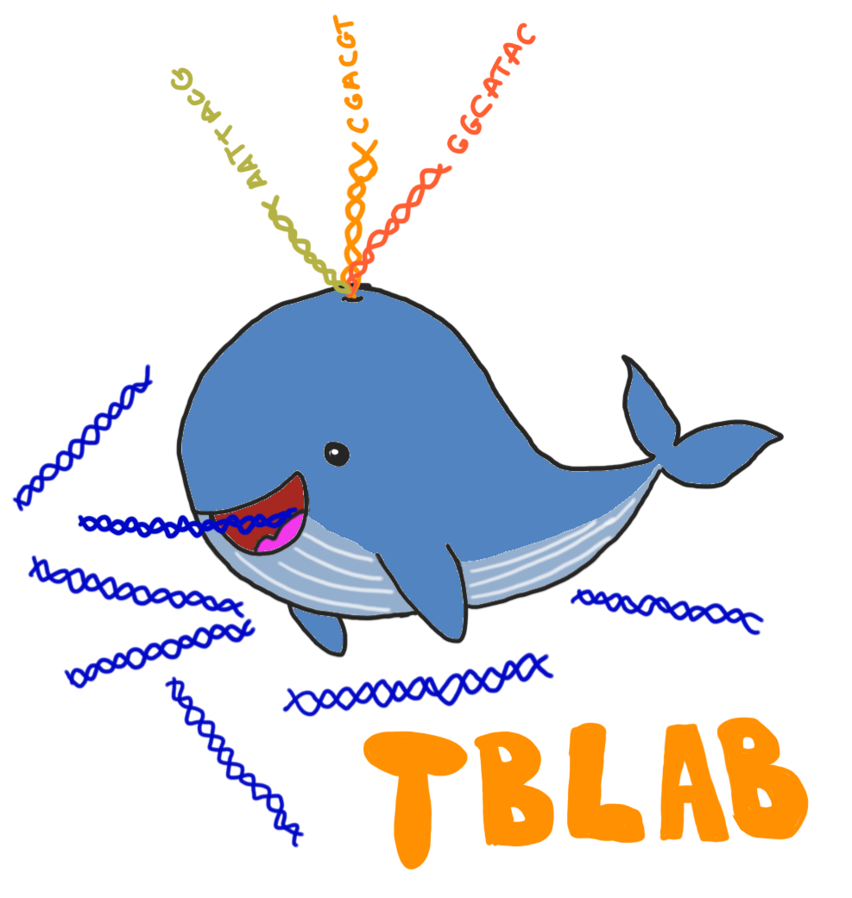
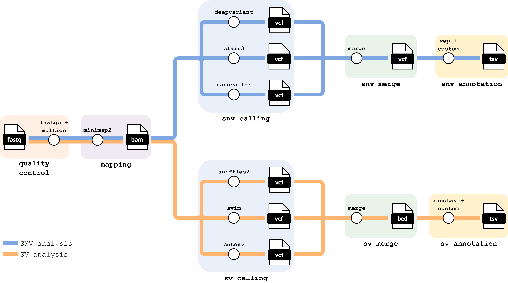

# WHALE: (W)orkflow for (H)uman-genome (A)nalysis of (L)ong-read (E)xperiments

<p align="center">
  
</p>

## Introduction

**WHALE** is a bioinformatics pipeline based on Nextflow and nf-core for long-read DNA sequencing analysis. It is optimized for the study and diagnosis of rare diseases. It takes a samplesheet as input and performs quality control, alignment, variant calling, variant integration and annotation.

<p align="center">
  
</p>

## Pipeline summary

1. Read QC ([`FastQC`](https://www.bioinformatics.babraham.ac.uk/projects/fastqc/))
2. Present QC for raw reads ([`MultiQC`](http://multiqc.info/))
3. Alignment ([`Minimap2`](https://github.com/lh3/minimap2))
4. Variant calling
    - Single Nucleotide Variant (SNV) calling ([`DeepVariant`](https://github.com/google/deepvariant), [`Clair3`](https://github.com/HKU-BAL/Clair3), [`NanoCaller`](https://github.com/WGLab/NanoCaller))
    - Structural Variant (SV) calling ([`Sniffles2`](https://github.com/fritzsedlazeck/Sniffles), [`CuteSV`](https://github.com/tjiangHIT/cuteSV), [`SVIM`](https://github.com/eldariont/svim))
5. Merge variant calling
6. Annotation
    - SNV annotation ([`VEP`](https://github.com/Ensembl/ensembl-vep))
    - SV annotation ([`AnnotSV`](https://github.com/lgmgeo/AnnotSV))

## Usage

First, prepare a samplesheet with your input data. Depending on which step of the analysis you want to run, the input data type can be: fastq, bam (and bai), vcf or bed. The samplesheet should look as follows:

`samplesheet.csv`:

```csv
sample,fastq
A123,/path/to/your/input/file/A123.fastq.gz
B456,/path/to/your/input/file/B456.fastq.gz
```

There are two types of full analysis:
- SNV analysis: -profile snv_analysis
- SV analysis: -profile sv_analysis
    
  Each full analysis can start with:
  - Alignment: --step mapping (input data type: fastq) (default)
  - Variant calling: --step variant_calling (input data type: bam and bai)
    
A specific step of the analysis can be executed:
- SNV calling (and merge): -profile snv_calling (input data type: bam and bai)
- SV calling (and merge): -profile sv_calling (input data type: bam and bai)
- SNV annotation: -profile snv_annotation (input data type: vcf)
- SV annotation: -profile sv_annotation (input data type: bed)

Profiles to use in the CCC (UAM):
- -profile uam,singularity,batch
- -profile uam_allcontigs,singularity,batch

Profiles to use in the server:
- -profile tblabserver,singularity
- -profile tblabserver_allcontigs,singularity

## Examples

SNV and SV analysis starting with variant calling in the server:

```bash
nextflow run WHALE \
   -profile snv_analysis,sv_analysis,tblabserver,singularity \
   --input samplesheet.csv \
   --outdir <OUTDIR> \
   --step variant_calling
```

SV calling in the CCC:

```bash
nextflow run WHALE \
   -profile sv_calling,uam,singularity,batch \
   --input samplesheet.csv \
   --outdir <OUTDIR>
```

## Pipeline output

**WHALE** will create the following subdirectories in the output directory:
- alignment
- snv_calling
  - snv_merge
- snv_annotation
- sv_calling
  - sv_merge
- sv_annotation
  - overlapping_sv_samples
- multiqc
- pipeline_info

## Citations

An extensive list of references for the tools used by the pipeline can be found in the [`CITATIONS.md`](CITATIONS.md) file.

Illustration by [Yolanda Benítez](https://github.com/yolandabq)
