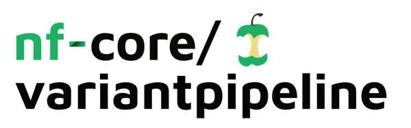

<h1>
  <picture>
    <source media="(prefers-color-scheme: dark)" srcset="docs/images/nf-core-variantpipeline_logo_dark.png">
    
  </picture>
</h1>

## Introduction

**WHALE** is a bioinformatics pipeline based on Nextflow and nf-core for long-read DNA sequencing analysis. It takes a samplesheet as input and performs quality control, alignment, variant calling and annotation.

<!-- TODO nf-core: Include a figure that guides the user through the major workflow steps. Many nf-core
     workflows use the "tube map" design for that. See https://nf-co.re/docs/contributing/design_guidelines#examples for examples.   -->
<!-- TODO nf-core: Fill in short bullet-pointed list of the default steps in the pipeline -->

## Pipeline summary

1. Read QC ([`FastQC`](https://www.bioinformatics.babraham.ac.uk/projects/fastqc/))
2. Present QC for raw reads ([`MultiQC`](http://multiqc.info/))
3. Alignment ([`Minimap2`](https://github.com/lh3/minimap2))
4. Variant calling
    - Single Nucleotide Variant (SNV) calling ([`DeepVariant`](https://github.com/google/deepvariant), [`Clair3`](https://github.com/HKU-BAL/Clair3), [`NanoCaller`](https://github.com/WGLab/NanoCaller))
    - Structural Variant (SV) calling ([`Sniffles2`](https://github.com/fritzsedlazeck/Sniffles), [`CuteSV`](https://github.com/tjiangHIT/cuteSV), [`SVIM`](https://github.com/eldariont/svim))
5. Merge variant calling
6. Annotation
    - SNV annotation ([`VEP`](https://github.com/Ensembl/ensembl-vep))
    - SV annotation ([`AnnotSV`](https://github.com/lgmgeo/AnnotSV))

## Usage

First, prepare a samplesheet with your input data. Depending on which step of the analysis you want to run, the input data type can be: fastq, bam (and bai), vcf or bed. The samplesheet should look as follows:

`samplesheet.csv`:

```csv
sample,fastq
A123,/path/to/your/input/file/A123.fastq.gz
B456,/path/to/your/input/file/B456.fastq.gz
```

There are two types of full analysis:
- SNV analysis: -profile snv_analysis
- SV analysis: -profile sv_analysis
    
  Each full analysis can be started with one of these data types:
  - fastq (--step mapping) (default)
  - bam (--step variant_calling)
    
A specific step of the analysis can be executed:
- SNV calling: -profile snv_calling
- SV calling: -profile sv_calling
- SNV annotation: -profile snv_annotation
- SV annotation: -profile sv_annotation

Profiles to use in the CCC (UAM):
- -profile uam,singularity,batch
- -profile uam_allcontigs,singularity,batch

Profiles to use in the server:
- -profile tblabserver,singularity
- -profile tblabserver_allcontigs,singularity

## Examples

SNV analysis starting with bam files in the server:

```bash
nextflow run WHALE/ \
   -profile snv_analysis,tblabserver,singularity \
   --input samplesheet.csv \
   --outdir <OUTDIR>
   --step variant_calling
```

SV calling in the CCC:

```bash
nextflow run WHALE/ \
   -profile sv_calling,uam,singularity,batch \
   --input samplesheet.csv \
   --outdir <OUTDIR>
```

## Pipeline output

**WHALE** will create the following subdirectories in the output directory:
- alignment
- snv_calling
  - snv_merge
- snv_annotation
- sv_calling
  - sv_merge
- sv_annotation
  - overlapping_sv_samples
- multiqc
- pipeline_info

## Citations

An extensive list of references for the tools used by the pipeline can be found in the [`CITATIONS.md`](CITATIONS.md) file.

You can cite the `nf-core` publication as follows:

> **The nf-core framework for community-curated bioinformatics pipelines.**
>
> Philip Ewels, Alexander Peltzer, Sven Fillinger, Harshil Patel, Johannes Alneberg, Andreas Wilm, Maxime Ulysse Garcia, Paolo Di Tommaso & Sven Nahnsen.
>
> _Nat Biotechnol._ 2020 Feb 13. doi: [10.1038/s41587-020-0439-x](https://dx.doi.org/10.1038/s41587-020-0439-x).
